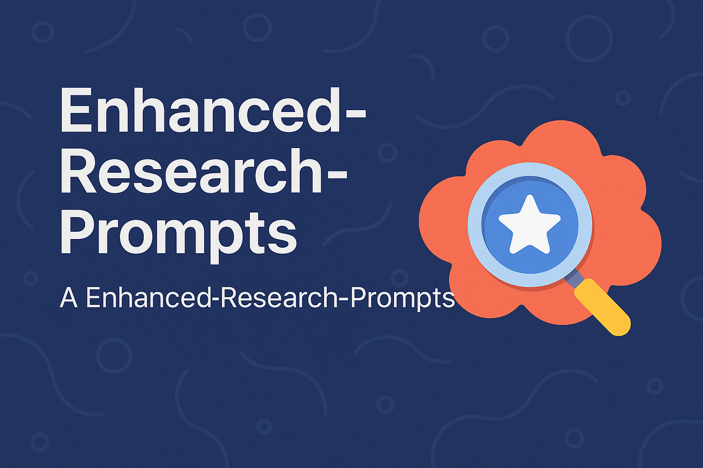

  

# Enhanced Research Prompts

A library of research prompts built for **today's AI assistants** — the ones with web search,
deep-research modes, and connections to your company's data. Every prompt demands sourced,
verified, confidence-labeled findings and produces a defined deliverable, from a quick briefing
to a forensic incident report.

Works in Claude, ChatGPT, Gemini, Copilot, and any assistant that can search the web. Degrades
gracefully when it can't: prompts instruct the AI to disclose missing capabilities and label
unverified content instead of faking it.

## Quick start

1. **Pick a prompt** from the table below and open it in [`prompts/`](prompts/).
2. **Paste it** into your AI assistant, replacing `[topic]` (and any optional fields you want).
   For best results use the assistant's research/extended mode and enable web search.
3. **Optionally attach an output template** from [`outputs/`](outputs/) to control exactly what
   the deliverable looks like.

## Choosing a prompt

| You need to... | Use | Default output |
|---|---|---|
| Get smart on a topic before a meeting, fast | [quick-research-briefing](prompts/general/quick-research-briefing.md) | inline briefing |
| Do full-depth research behind a real decision | [comprehensive-research-analysis](prompts/general/comprehensive-research-analysis.md) | [research-report](outputs/research-report.md) |
| Map an engineering domain you don't know yet | [engineering-domain-explorer](prompts/engineering/engineering-domain-explorer.md) | domain map |
| Assess a technology like an analyst (due diligence, invest/adopt) | [engineering-technical-analysis](prompts/engineering/engineering-technical-analysis.md) | [research-report](outputs/research-report.md) |
| Investigate a failure, incident, or near miss | [failure-analysis-investigation](prompts/engineering/failure-analysis-investigation.md) | [incident-analysis-report](outputs/incident-analysis-report.md) |
| Rate how mature a technology really is (hype filter) | [technology-readiness-assessment](prompts/engineering/technology-readiness-assessment.md) | [research-report](outputs/research-report.md) |
| Map the codes, standards, and regulations that apply | [standards-regulatory-research](prompts/engineering/standards-regulatory-research.md) | [research-report](outputs/research-report.md) |
| Size and understand a market | [market-research-analysis](prompts/market/market-research-analysis.md) | [market-research-report](outputs/market-research-report.md) |
| Tear down the competition | [competitive-landscape-analysis](prompts/market/competitive-landscape-analysis.md) | [research-report](outputs/research-report.md) |
| Map who's patenting what in a technology area | [patent-landscape-analysis](prompts/patents/patent-landscape-analysis.md) | [research-report](outputs/research-report.md) |
| Sweep for prior art before talking to patent counsel | [prior-art-exploration](prompts/patents/prior-art-exploration.md) | [research-report](outputs/research-report.md) |
| Build a SWOT that survives scrutiny | [swot-analysis](prompts/strategy/swot-analysis.md) | [swot-one-pager](outputs/swot-one-pager.md) |

The patent and standards prompts are research aids with explicit boundaries — they are **not**
legal advice, and they say so in their deliverables.

## How every prompt works

All twelve prompts share one anatomy, so once you've used one, you know them all:

1. **Capability check** — search the web if you can (mandatory, not optional); search internal
   company data if connected, keeping those findings marked `[INTERNAL]` and separated; if no
   tools, disclose it and label everything unverified.
2. **Scoping** — the AI asks a couple of clarifying questions when the topic is ambiguous, or
   states its assumptions and proceeds.
3. **A research protocol** — the analytical framework specific to that prompt.
4. **Evidence standards** — cite every non-obvious claim (title, publisher, date, URL);
   cross-check the claims conclusions depend on across independent sources; flag `single source`
   claims; label estimates and show methods; **never fabricate a source, statistic, or quote**.
5. **Confidence labels** — every key finding is marked **High / Moderate / Low / Inference**, so
   you know how much weight it bears.
6. **An output contract** — a defined deliverable structure, either inline or from
   [`outputs/`](outputs/).
7. **A pre-delivery checklist** — the AI self-checks before handing over.

## Output templates

The [`outputs/`](outputs/) folder defines the deliverables: research report, executive briefing,
white paper, technical brief, case study, market research report, SWOT one-pager, and a forensic
incident-analysis format. Each specifies required sections, length, audience, and writing
standards.

Templates are company-neutral, with `[PLACEHOLDER]` tokens for branding. To adopt them for your
organization: copy [`outputs/style-guide-template.md`](outputs/style-guide-template.md), fill in
your identity, colors, fonts, and boilerplate once, keep the filled copy private, and hand it to
your AI alongside any template. Details in [`outputs/README.md`](outputs/README.md).

## Use it as a Claude Skill

Prefer never pasting prompts at all? The whole library ships as a ready-made **`deep-research`**
Agent Skill in [`skills/`](skills/) — install it once in Claude Code (`.claude/skills/`) or
upload the zip to claude.ai / Claude Desktop, then just ask for research: Claude picks the right
protocol, follows the evidence rules, and delivers in the right format automatically. Setup,
style binding, and troubleshooting: [`skills/README.md`](skills/README.md).

## Platform notes

- **Claude** — paste the prompt, or add prompts + output templates to a Project so they're always
  in context. Use Research mode for the comprehensive prompts. Internal data arrives via
  connectors/MCP (Drive, SharePoint, etc.); the `[INTERNAL]` separation in the prompts assumes
  exactly this setup.
- **ChatGPT** — use Deep Research for the comprehensive prompts; enable browsing for everything
  else. Templates can live in a Project or a custom GPT's knowledge.
- **Gemini** — use Deep Research; Workspace grounding covers the internal-data pass.
- **Anything else** — the prompts assume nothing platform-specific; they check capabilities at
  runtime and degrade honestly.

## Working the library

- Start broad, then narrow: `engineering-domain-explorer` produces the smart questions that make
  `comprehensive-research-analysis` or `engineering-technical-analysis` productive.
- Chain deliverables: a market entry decision might run market-research → competitive-landscape
  → SWOT, each feeding the next.
- The briefing prompts (`quick-research-briefing`) are the cheap first pass; escalate to the
  comprehensive prompts when the stakes justify it.

## What changed in v2 (2026)

The original nine prompts (2025) were written for chat-only models: search was optional or
absent, "recommend resources" invited hallucinated reading lists, and no deliverable was defined.
v2 consolidates them into four modernized successors — the two generations of each lineage merged
— and adds eight new prompts across market, patents, standards, strategy, and failure analysis,
plus the `outputs/` deliverable system. The original files live on in the git history.

## License

[MIT](LICENSE). Use them, adapt them, ship them.
